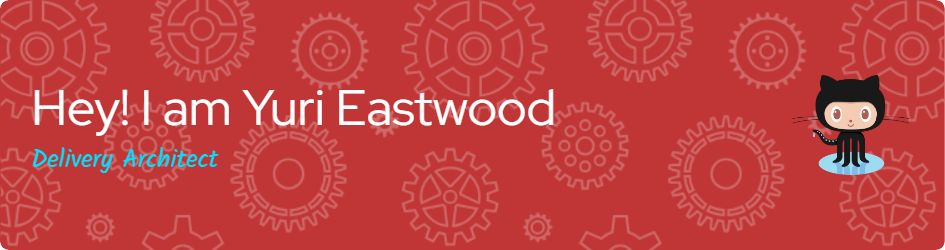
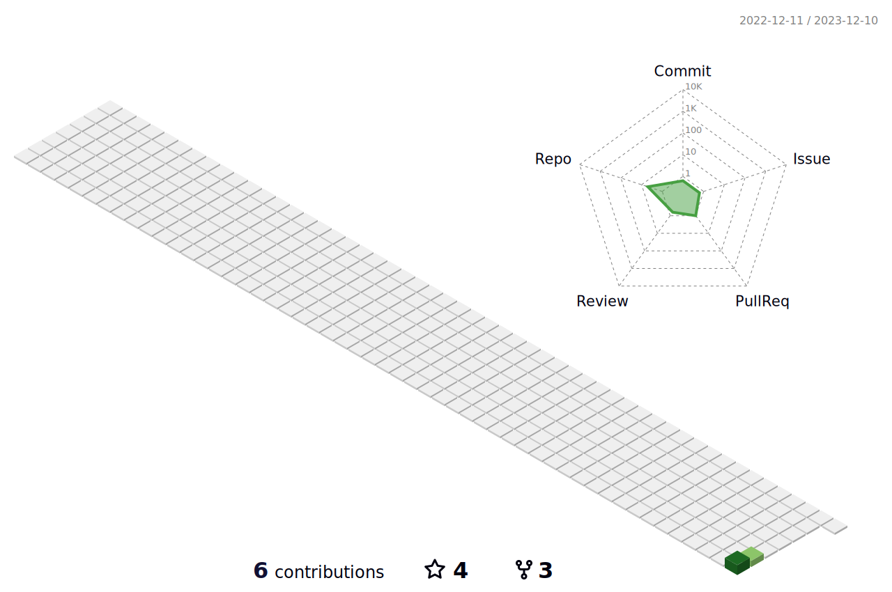
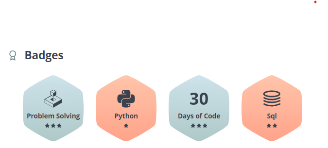

<!--   my-icons -->
<p align="center">
    <a href="https://github.com/yurieastwood/yurieastwood"></a>
    <a href="https://github.com/python/cpython"></a>
    <a href="https://github.com/yurieastwood/yurieastwood/graphs/contributors"></a>
    <a href="https://github.com/yurieastwood/yurieastwood/stargazers"></a>
    <a href="https://github.com/yurieastwood/yurieastwood/network/members"></a>
       
</p>

<!--   my-header-img -->



<!--   my-ticker -->    
[](https://git.io/typing-svg)


<!--   my-skils -->

| Property                                        | Data                                                                                                                                                                                                                                                                                                                                                                                                                                                                                                                                                                                                                                                                                                                                                                                                                                                                                                                                                                                                                                                                                                                                                                                                                                                                                                                                                                                                                                                                                                                                                                                                                                                                                                                                                                                                            |
|-------------------------------------------------|-----------------------------------------------------------------------------------------------------------------------------------------------------------------------------------------------------------------------------------------------------------------------------------------------------------------------------------------------------------------------------------------------------------------------------------------------------------------------------------------------------------------------------------------------------------------------------------------------------------------------------------------------------------------------------------------------------------------------------------------------------------------------------------------------------------------------------------------------------------------------------------------------------------------------------------------------------------------------------------------------------------------------------------------------------------------------------------------------------------------------------------------------------------------------------------------------------------------------------------------------------------------------------------------------------------------------------------------------------------------------------------------------------------------------------------------------------------------------------------------------------------------------------------------------------------------------------------------------------------------------------------------------------------------------------------------------------------------------------------------------------------------------------------------------------------------|
| **Language / Framework / IDE**                              |                                                                                                                                                                                                                                                                                                                                                                                                                                                                                                                                                                                                                                                                                                                                                                                                                                                                                                                                                                                                                                                                                                                                                                                                                                                                                                                                                                                                                                                                                                          |
| **Domain Knownledge**                           | [](https://github.com/search?q=user%3Ayurieastwood&type=Repositories) [](https://github.com/search?q=user%3Ayurieastwood&type=Repositories) [](https://github.com/search?q=user%3Ayurieastwood&type=Repositories)                                                                                                                                                                                                                                                                                                                                                                                                                                                                                                                                                                                                                                                                                                                                                                                                                                                                                                                                                                                                                                                                                      |
| **CI / CD**                                     |                                                                                                                                                                                                                                                                                                                                                                                                                                                                                                                                                                                                                                                                                                                                                                                                                                                                                                                                                                                                                                                                                                                                                                                                                                                                                                                                                                                          |
| **Databases**                                   |                                                                                                                                                                                                                                                                                                                                                                                                                                                                                                                                                                                                                                                                                                                                                                                                                                                                                                                                                        |
| **OS**                                          |                                                                                                                                                                                                                                                                                           |
| **Tools & Platform**                            |                                                                                                                                                                                                                                                                                                                                                                                                                                                                                                                                                                                                                                                                                                                                                                                                                                                                                                                                                                                                                                                                                                                                                                                                                                                                                                                                                                                                               |

<!--   GitHub stats graph -->
### 📈 GitHub Activity Graph:
<!-- [](https://github.com/yurieastwood/github-readme-activity-graph) -->

| .                                                                                                                                       | .                                                                                                                         |
|-----------------------------------------------------------------------------------------------------------------------------------------|---------------------------------------------------------------------------------------------------------------------------|
|  |  |

</img>

<!--   profile-green-animate -->


<!--   grid-snake -->


<!--   skyline 
<a href="https://skyline.github.com/yurieastwood/2022"></a>
-->

<!--  2d history skills -->
</img>

**📫 How to Reach me:**
<p align="left">
<a href="https://twitter.com/yurieastwood" target="blank"></a>
<a href="https://linkedin.com/in/yurieastwood" target="blank"></a>
<a href="mailto:yuri.eastwood@outlook.com" target="blank"></a>
</p>

<div align="center">
  <summary>Trophy: Github Profile Trophy</summary>
</div>

<p align="center"> 
  <a href="https://github.com/ryo-ma/github-profile-trophy"></a>
</p>

```mermaid
graph TD;
    A[Solutions Architect]-->B[Market Opportunity];
    A[Solutions Architect]-->C[Project Timeline];
    A[Solutions Architect]-->D[Business Goal];
    A[Solutions Architect]-->E[Budget];
    A[Solutions Architect]-->F[Market Opportunity];
    A[Solutions Architect]-->G[Target Dates];
    A[Solutions Architect]-->H[Resourcing];
    A[Solutions Architect]-->I[Technology Values & Requirements];
    A[Solutions Architect]-->J[Increased ROI];
   ```

<div align="center">
  <summary>Trophy: Stackoverflow Profile Trophy</summary>
</div>

<p align="center">
  <a href="https://stackoverflow.com/users/3212472/yuri-eastwood"></a>
</p>

<div align="center">
  <summary>Trophy: Hackerrank Profile Trophy</summary>
</div>

<p align="center">
   
</p>


  
 ```geojson
{
  "type": "FeatureCollection",
  "features": [
    {
      "type": "Feature",
      "properties": {},
      "geometry": {
        "type": "Polygon",
        "coordinates": [
          [
            [
              -46.32254089425774,
              -23.914974960220594
            ],
            [
              -46.32776874108627,
              -23.91520964981297
            ],
            [
              -46.33294629745624,
              -23.91591146094451
            ],
            [
              -46.33802375506613,
              -23.917073642323455
            ],
            [
              -46.34295226536762,
              -23.91868501374205
            ],
            [
              -46.347684408081456,
              -23.920730073279614
            ],
            [
              -46.35217464619409,
              -23.923189145963814
            ],
            [
              -46.35637976311794,
              -23.926038572482632
            ],
            [
              -46.36025927785823,
              -23.929250936158805
            ],
            [
              -46.363775834227866,
              -23.93279532603453
            ],
            [
              -46.36689556038677,
              -23.936637633569106
            ],
            [
              -46.36958839525184,
              -23.940740880130083
            ],
            [
              -46.37182837862664,
              -23.94506557216206
            ],
            [
              -46.37359390223313,
              -23.949570080649334
            ],
            [
              -46.374867919189235,
              -23.95421104125175
            ],
            [
              -46.375638109862294,
              -23.95894377129015
            ],
            [
              -46.37589700243705,
              -23.96372269959016
            ],
            [
              -46.37564204696352,
              -23.96850180506302
            ],
            [
              -46.37487564209134,
              -23.973235059811344
            ],
            [
              -46.37360511414971,
              -23.977876872496477
            ],
            [
              -46.371842648690574,
              -23.98238252769426
            ],
            [
              -46.36960517507315,
              -23.98670861699719
            ],
            [
              -46.366914205126875,
              -23.99081345769328
            ],
            [
              -46.36379562738026,
              -23.994657494965477
            ],
            [
              -46.360279458783396,
              -23.99820368370852
            ],
            [
              -46.35639955627423,
              -24.001417846252266
            ],
            [
              -46.3521932909414,
              -24.00426900250942
            ],
            [
              -46.347701187912186,
              -24.006729669329815
            ],
            [
              -46.342966535441754,
              -24.008776126139605
            ],
            [
              -46.33803496699213,
              -24.01038864426999
            ],
            [
              -46.332954020365555,
              -24.01155167773273
            ],
            [
              -46.3277726781914,
              -24.01225401357491
            ],
            [
              -46.32254089425774,
              -24.012488880340392
            ],
            [
              -46.31730911032409,
              -24.01225401357491
            ],
            [
              -46.312127768149935,
              -24.01155167773273
            ],
            [
              -46.30704682152335,
              -24.01038864426999
            ],
            [
              -46.30211525307373,
              -24.008776126139605
            ],
            [
              -46.2973806006033,
              -24.006729669329815
            ],
            [
              -46.29288849757409,
              -24.00426900250942
            ],
            [
              -46.28868223224124,
              -24.001417846252266
            ],
            [
              -46.284802329732095,
              -23.99820368370852
            ],
            [
              -46.28128616113523,
              -23.994657494965477
            ],
            [
              -46.278167583388615,
              -23.99081345769328
            ],
            [
              -46.275476613442336,
              -23.98670861699719
            ],
            [
              -46.273239139824916,
              -23.98238252769426
            ],
            [
              -46.27147667436577,
              -23.977876872496477
            ],
            [
              -46.27020614642415,
              -23.973235059811344
            ],
            [
              -46.26943974155197,
              -23.96850180506302
            ],
            [
              -46.26918478607843,
              -23.96372269959016
            ],
            [
              -46.2694436786532,
              -23.95894377129015
            ],
            [
              -46.270213869326255,
              -23.95421104125175
            ],
            [
              -46.27148788628236,
              -23.949570080649334
            ],
            [
              -46.27325340988885,
              -23.94506557216206
            ],
            [
              -46.275493393263645,
              -23.940740880130083
            ],
            [
              -46.27818622812871,
              -23.936637633569106
            ],
            [
              -46.281305954287625,
              -23.93279532603453
            ],
            [
              -46.28482251065726,
              -23.929250936158805
            ],
            [
              -46.28870202539755,
              -23.926038572482632
            ],
            [
              -46.2929071423214,
              -23.923189145963814
            ],
            [
              -46.29739738043403,
              -23.920730073279614
            ],
            [
              -46.30212952314786,
              -23.91868501374205
            ],
            [
              -46.30705803344935,
              -23.917073642323455
            ],
            [
              -46.31213549105924,
              -23.91591146094451
            ],
            [
              -46.317313047429224,
              -23.91520964981297
            ],
            [
              -46.32254089425774,
              -23.914974960220594
            ]
          ]
        ]
      }
    }
  ]
}
```

<p align="center"> 
  
</p>

#### Thanks for visiting :heart:
<p align="center"> 
    

  counting of visitors to this page in this section started December 09, 2023
  <a href="https://info.flagcounter.com/5gCK"></a>

  ## Star History
  [](https://star-history.com/#yurieastwood/yurieastwood&Date)

  ### Profile Views
  counting of visitors to this page in this section started from December 09, 2023
  
  </br>

  [MIT](LICENSE)
</p>

---
  *If you liked my profile, you can Star ⭐ the repo and if you want to use this template you can Fork it and can use.* 
---
Would you ike to meet me?

If you want to contribute to any of my repositories, feel free to submit PRs, issues and email me. Pick a slot if you'd like to meet me and chat about proposals and ideas - but make sure to describe the agenda

---
  *I use an automatic subscription control system. Thus, everyone who subscribes to me, I will subscribe to those and I will respond, and vice versa, I will remove all those who unsubscribe from me from among those who should be followed.* 
---

