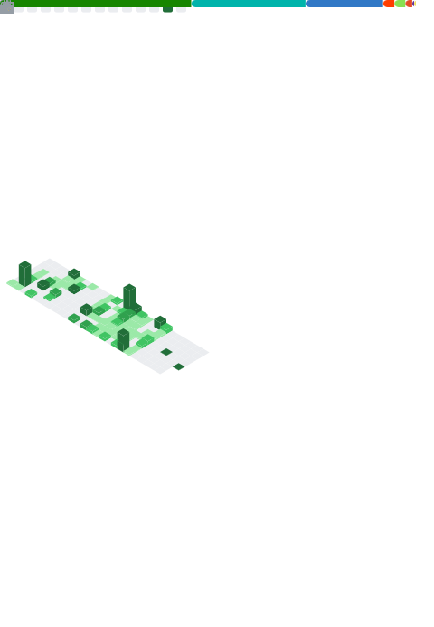

> [!NOTE]
> I'm a Managing Delivery Architect with over fifteen years of experience in software development and architecture.
> I write about agentic development, spec-driven engineering, and bridging the gap between architecture and delivery.
> Always open to collaborating on meaningful open-source work.

<table>
  <tr>
    <td></td>
    <td><strong>Currently working on</strong> — Guardrails and patterns for agentic development in enterprise software delivery</td>
  </tr>
  <tr>
    <td></td>
    <td><strong>Currently learning</strong> — AI-assisted software engineering workflows and their impact on delivery practices</td>
  </tr>
  <tr>
    <td></td>
    <td><strong>Looking to collaborate on</strong> — Open-source tooling for software delivery, developer experience, and agentic development frameworks</td>
  </tr>
  <tr>
    <td></td>
    <td><strong>Ask me about</strong> — Software architecture, .NET, Azure, delivery practices, SAFe, or how to bridge the gap between architecture and hands-on engineering</td>
  </tr>
  <tr>
    <td></td>
    <td><strong>How to reach me</strong> — Connect with me on <a href="https://linkedin.com/in/yurieastwood">LinkedIn</a></td>
  </tr>
</table>

---

## Socials

### Professional

  

### Social / Streaming

   

---

## Tech Stack

### Languages

       

### Cloud and Infrastructure

   

### Frameworks

 

### Databases

         

### DevOps and CI/CD

      

### Observability

    

### Quality and Tools

     

---

## Recent Activity

<!--START_SECTION:activity-->
1. 📝 Committed to main in [yurieastwood/yurieastwood](https://github.com/yurieastwood/yurieastwood/commit/81e14ba1a3f146c3c467a3ade739f3b69a8a7aba)
2. 📝 Committed to main in [yurieastwood/yurieastwood](https://github.com/yurieastwood/yurieastwood/commit/dab6e3ecbeebf5d6c76256c157555978080dbd03)
3. 📝 Committed to main in [yurieastwood/yurieastwood](https://github.com/yurieastwood/yurieastwood/commit/3860ae7d2a75f5247ca346cfdca917c1c5247d52)
4. 📝 Committed to main in [yurieastwood/yurieastwood](https://github.com/yurieastwood/yurieastwood/commit/c8e01add234473adf60550da2fb91967aed289ce)
5. 📝 Committed to main in [yurieastwood/yurieastwood](https://github.com/yurieastwood/yurieastwood/commit/6183412ef30fa491b303eec537b510712bff9b0a)
<!--END_SECTION:activity-->

---

## Articles

- [Guardrails for Agentic Development](https://www.linkedin.com/pulse/guardrails-agentic-development-yuri-eastwood-vntpc) — Mar 2026
- [Spec-Driven Development: Stability in the Age of GenAI-Assisted Software Engineering](https://www.linkedin.com/pulse/spec-driven-development-stability-age-genai-assisted-yuri-eastwood-tss3c) — Nov 2025
- [Understanding Customer Problems: (One) Key to Success](https://www.linkedin.com/pulse/understanding-customer-problems-one-key-success-yuri-eastwood-2ozme) — Jan 2024

## Latest Posts

<!-- BLOG-POST-LIST:START -->
<!-- BLOG-POST-LIST:END -->

---

## Achievements

---

## GitHub Metrics

  
  

---

 

